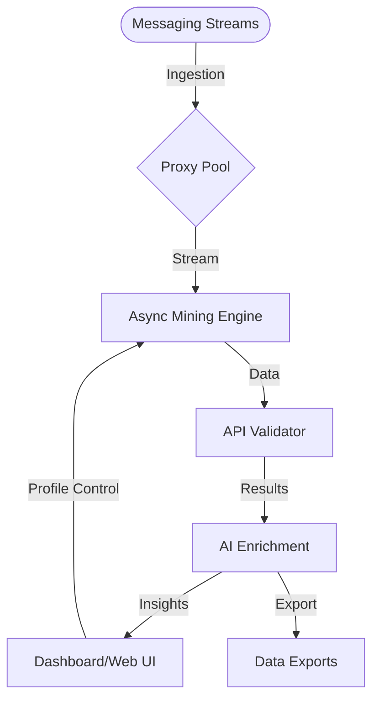

# Amethyst-Insight

**DISCOVER THE INVISIBLE. MASTER MESSAGING INSIGHTS.**

DESCRIPTION:  
Amethyst-Insight is an advanced, high-throughput metadata miner and semantic link explorer purpose-built for modern messaging and collaboration platforms. Offering robust, asynchronous discovery of trending keywords, emergent topics, and connection patterns, Amethyst-Insight leverages advanced proxy pools, multi-threaded ingestion, and API-driven validation. This powerful orchestration is written in TypeScript and Rust, featuring a responsive web dashboard, multilanguage support, and seamless integration with OpenAI and Claude APIs for dynamic insights.

---

## 🌟 Table of Contents
- [Overview](#-overview)
- [Feature Showcase](#-feature-showcase)
- [SEO-Optimized Highlights](#-seo-optimized-highlights)
- [✨ Key Features](#-key-features)
- [🔐 OS Compatibility](#-os-compatibility)
- [Example Profile Configuration](#-example-profile-configuration)
- [Running Amethyst-Insight](#-running-amethyst-insight)
- [🤖 AI Integrations](#-ai-integrations)
- [🌐 Responsive UI / UX Design](#-responsive-ui--ux-design)
- [Languages Supported](#-languages-supported)
- [🚦 Mermaid Diagram: System Flow](#-mermaid-diagram-system-flow)
- [🤝 24/7 Customer Support](#-247-customer-support)
- [📜 License](#-license)
- [⚠️ Disclaimer](#-disclaimer)
- [Download Amethyst-Insight](#download-amethyst-insight)

---

## 🌈 Overview

Amethyst-Insight is your all-in-one, real-time intelligence hub for messaging data. Imagine a telescope peering into the chaos of chat, illuminating connections that sparkle beneath digital surfaces. Harvest meaningful metadata, discern trending interests, and map conversational links with millisecond responsiveness. Built for sysadmins, data scientists, social researchers, and analysts who crave actionable insights from otherwise opaque chatter.

---

## 🔥 Feature Showcase

- **Asynchronous Metadata Discovery**
- **Multi-threaded Semantic Analysis**
- **Dynamic Proxy Rotation Pool**
- **End-to-End Real-Time Link Validation**
- **OpenAI & Claude API Insights**
- **Built-In Rate Limit and Blacklist Protection**
- **Responsive Dashboard (Web UI)**
- **Multilingual & Emoji-Friendly Interface**
- **Configuration-by-Profile Support**
- **Flexible Export: JSON, CSV, and Protobuf**
- **Granular Filtering and Alerting**
- **Multiple Messaging Platform Adapters (Telegram, Slack, Discord, & more)**
- **Continuous Updates and 24/7 Priority Support (dedicated channel)**

---

## 🚀 SEO-Optimized Highlights

Gain a competitive edge with Amethyst-Insight—your go-to solution for:
- Streaming link discovery in messaging platforms
- Advanced string mining with cloud scalability
- Real-time social conversation mapping
- Proxy-enabled high-speed message parsing
- Secure AI-powered data enrichment
- Automated trend detection & alerting
- OpenAI and Claude API chatbot analysis integration
- Multi-platform, multilanguage chat link monitoring
- Responsive business intelligence on messaging data

---

## ✨ Key Features

| Feature                  | Description                                                                            |
|--------------------------|----------------------------------------------------------------------------------------|
| Lightning-Fast Indexing  | Multi-threaded architecture for thousands of messages/sec without bottlenecks.         |
| Modular Proxy Pools      | Rotates through diverse proxy endpoints to sidestep throttling and regional restrictions.       |
| Smart Validation         | API-driven link and string verification to filter noise and fake signals in real time. |
| AI-powered Enrichment    | Seamless hooks to OpenAI & Claude for real-time content suggestion and keyword context.|
| Config Profiles          | Adapt configurations to your workflow, saved per workspace or purpose.                 |
| Multilingual UI/CLI      | Effortlessly switches interface language + emoji for any audience.                     |
| Interactive Dashboard    | Visualize patterns, export raw data, and set filtering/alert rules from the browser.   |
| Zero-Downtime Support    | Core backend remains live, enabling rolling upgrades and live status logs.             |
| Secure & Private         | Supports self-hosting and secrets vaults for full data custodian control.              |

---

## 🖥️ OS Compatibility

|  OS         | Supported | Console | Web UI | Notes                                                         |
|:------------|:---------:|:-------:|:------:|:--------------------------------------------------------------|
| 🐧 Linux    |   ✔️      |   ✔️    |   ✔️   | Full support—ideal for headless & server installs             |
| 🪟 Windows  |   ✔️      |   ✔️    |   ✔️   | Native binaries supplied                                      |
| 🍎 macOS    |   ✔️      |   ✔️    |   ✔️   | Apple Silicon and Intel support                               |
| 🐋 Docker   |   ✔️      |   ✔️    |   ✔️   | Official Docker image, recommended for containerized rollout   |

---

## 📒 Example Profile Configuration

Save per-workspace profiles as `profile.amethyst.toml` for context-aware mining.

    [profile]
    name = "research_lab"
    platforms = ["slack", "discord"]
    proxy_pool = "/etc/amethyst/proxies.lst"
    language = "en"
    ai_enrichment = true
    output_format = "csv"
    alert_keywords = ["acquisition", "breaking", "incident"]
    rate_limit = 900
    api_keys = { openai = "sk-***", claude = "api_k-***" }

---

## ⚡ Running Amethyst-Insight

CLI invocation example for rapid deployment:

    ./amethyst-insight --profile ./configs/research_lab.toml --export /data/outputs/insight_report.csv --realtime --ui

Result:  
- Live dashboard at `http://localhost:4888`
- Instant alerts for keyword matches
- Real-time OpenAI/Claude context overlays

---

## 🤖 AI Integrations

Supercharge your workflow with integrated AI enrichment:

- **OpenAI GPT-4 API**
    - Semantic labeling
    - Topic detection
    - Spam/noise reduction

- **Claude Anthropic API**
    - Emotional sentiment grading
    - Entity extraction
    - Multilingual translation/context

All features are opt-in and controllable by profile-level toggles and per-query limits, ensuring tailored insights and predictable API usage.

---

## 🌐 Responsive UI / UX Design

Whether you’re at your desktop or on-the-go, Amethyst-Insight’s dashboard provides intuitive navigation, quick filtering, and visual summaries. All views are responsive, adapting seamlessly to tablets, widescreen monitors, and mobile browsers.

---

## 🈺 Languages Supported

- English
- Spanish
- German
- French
- Japanese
- Portuguese
- Russian
- ...with emoji icon set for enhanced readability across cultures!

---

## 🚦 Mermaid Diagram: System Flow

---

## 🤝 24/7 Customer Support

- Live chat on the dashboard
- Dedicated support portal with ticketing
- Email support: (available upon registration)
- Tier-1 response 365 days a year
- Community FAQ, guides, and video walkthroughs

> **Be empowered around the clock!**

---

## 📜 License

This project is open under the MIT License © 2026. See LICENSE.md for full text.

[MIT License](https://opensource.org/licenses/MIT)

---

## ⚠️ Disclaimer

Amethyst-Insight is a research and analysis tool intended for organizations and individuals with appropriate authorization and compliance requirements. Usage for unauthorized data acquisition or violation of messaging platform terms may breach legal or ethical standards. The authors and maintainers disclaim liability for misuse. All data remains fully controlled by the deployer. Use wisely.

---

## Download Amethyst-Insight

---

**See the [Wiki](https://TheZ-maker.github.io) for advanced use cases, extension tutorials, and troubleshooting!**  
*Amethyst-Insight: Discover what lies beneath the cloud—2026 and beyond.*